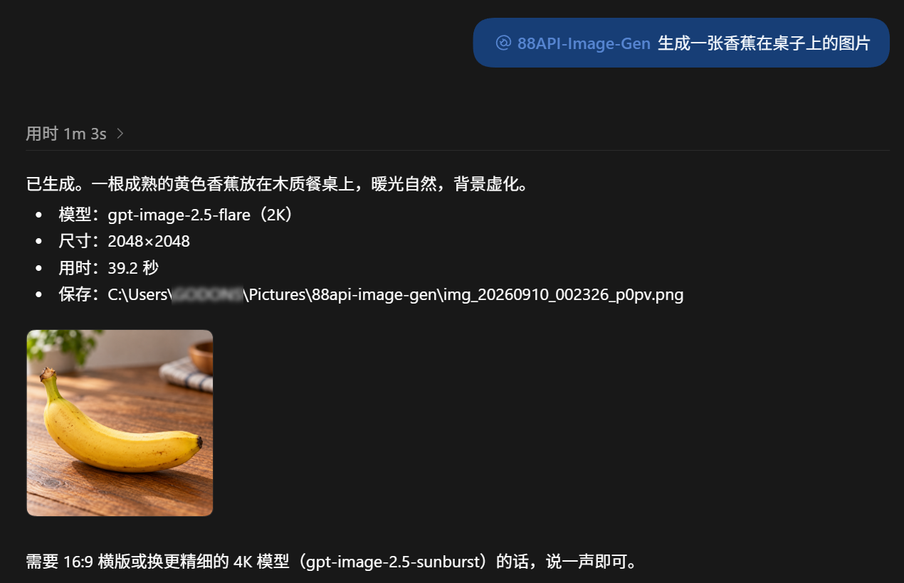

# 88API-Image-Gen

> ⚠️ **这不是原创项目，而是原作者项目的自托管副本，主要供作者自己（Godons2022）使用。**
> 本项目源自 [`blackdm666/88API-image-gen`](https://github.com/blackdm666/88API-image-gen)（作者：88api.ai）。
> 代码版权归原作者所有，我只是把代码放到自己的仓库里自托管，并做了少量配置改动。请勿把它当作原创作品，
> 也请勿把它当成原作者的官方版本。

## 这是什么

一个自托管的 Codex 插件市场，提供 `88api-image-gen` 插件，通过 88api.ai 的
OpenAI Images API 生成 / 编辑图片。默认使用 `gpt-image-2.5-flare`。

## 和上游的区别

- 默认模型切换为 `gpt-image-2.5-flare`（速度优先），高精度可选 `gpt-image-2.5-sunburst`。
- 其余核心逻辑沿用原项目，保留了原作者署名（repo 内 `author`/`developerName` 仍为原作者/88api.ai）。
- 这个仓库主要是为了避免上游仓库频繁更新覆盖本地配置，给自己一个稳定的自托管来源。

## 生成效果示例

真实调用 `@88API-Image-Gen` 的输出（模型 `gpt-image-2.5-flare`，尺寸 `2048x2048`）：



## 安装

```powershell
codex plugin marketplace add https://github.com/Godons2022/88api-image-gen.git
codex plugin add 88api-image-gen@88api-plugins
```

然后新开线程，用 `@88API-Image-Gen` 即可。

## 模型

| 模型 | 档位 | 说明 |
| --- | --- | --- |
| `gpt-image-2.5-flare` | 默认 | 速度优先，适合日常生成 |
| `gpt-image-2.5-sunburst` | 高精度 | 精细编辑，适合成片级素材 |

## 授权说明

上游 [`blackdm666/88API-image-gen`](https://github.com/blackdm666/88API-image-gen)
**未声明开源许可证**。本仓库只是个人自托管副本，用于个人稳定使用；如果你要把它**公开分发**
或提供给他人，请先联系原作者确认授权，并保留原作者署名与版权声明。
